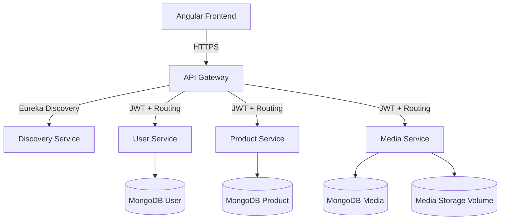

# Architecture Overview

- **Discovery Service**: Eureka server that registers the gateway and all backend services.
- **API Gateway**: Spring Cloud Gateway that validates JWT tokens, injects user context headers, secures endpoints and exposes Swagger documentation for each service.
- **User Service**: Manages registration, authentication (JWT + refresh tokens), profile updates, and role-based access controls.
- **Product Service**: Handles seller-scoped CRUD operations, ensuring ownership, and relies on the media service to validate product imagery.
- **Media Service**: Validates MIME type and file signatures, enforces the 2 MB limit, stores files on a dedicated volume, and issues signed URLs for controlled access.
- **Frontend**: Angular SPA served via Nginx, consuming the gateway APIs with route guards and JWT interceptors.

Each service uses its own MongoDB database to keep data boundaries clear. Internal service-to-service calls are performed via signed secrets over the gateway network.
